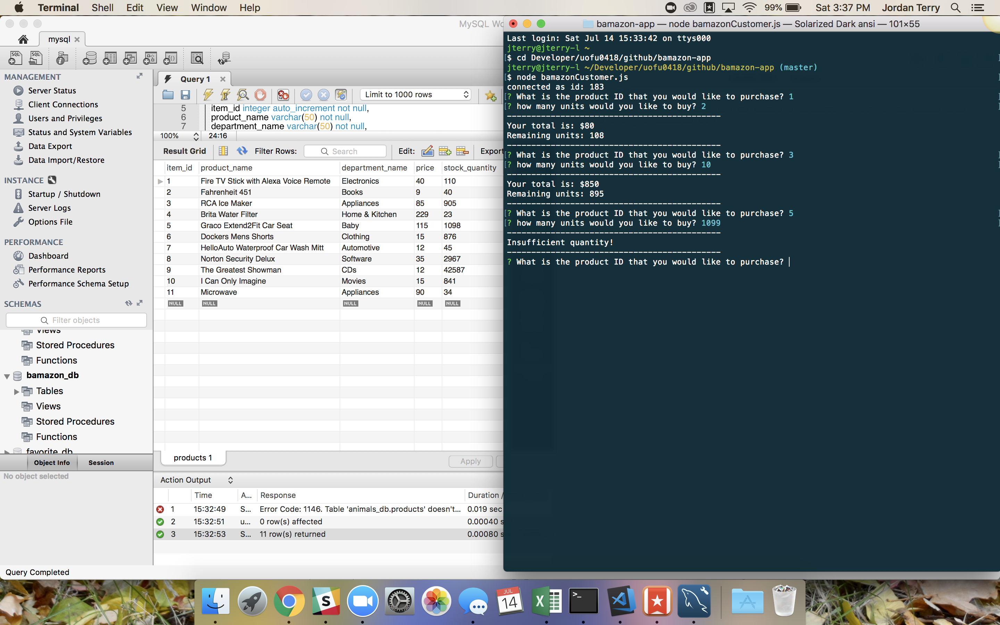
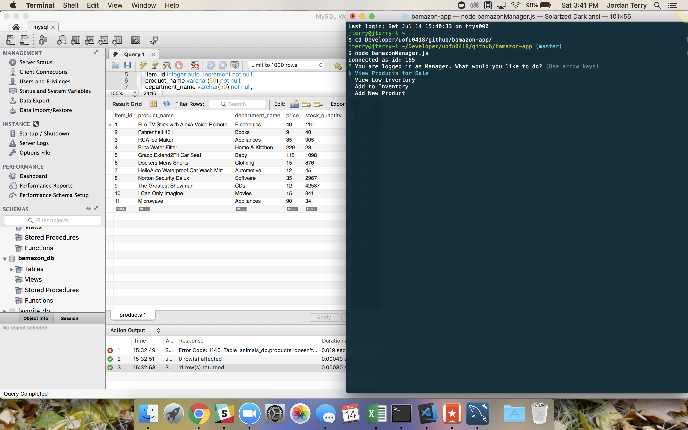
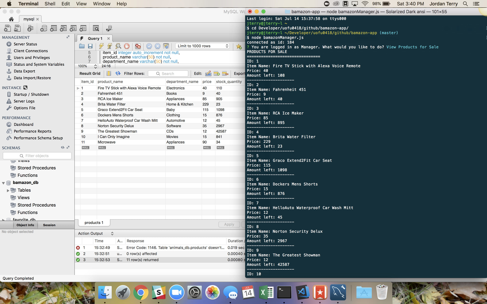
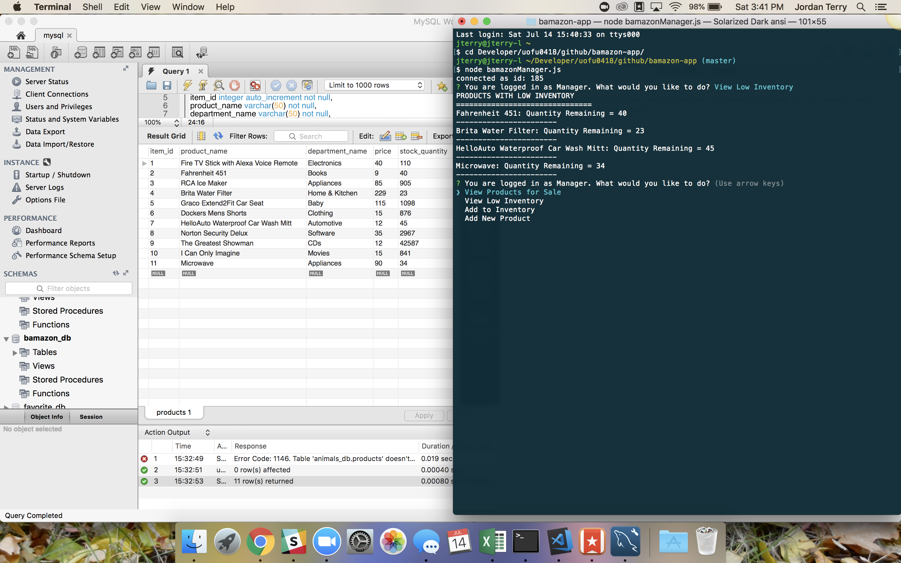
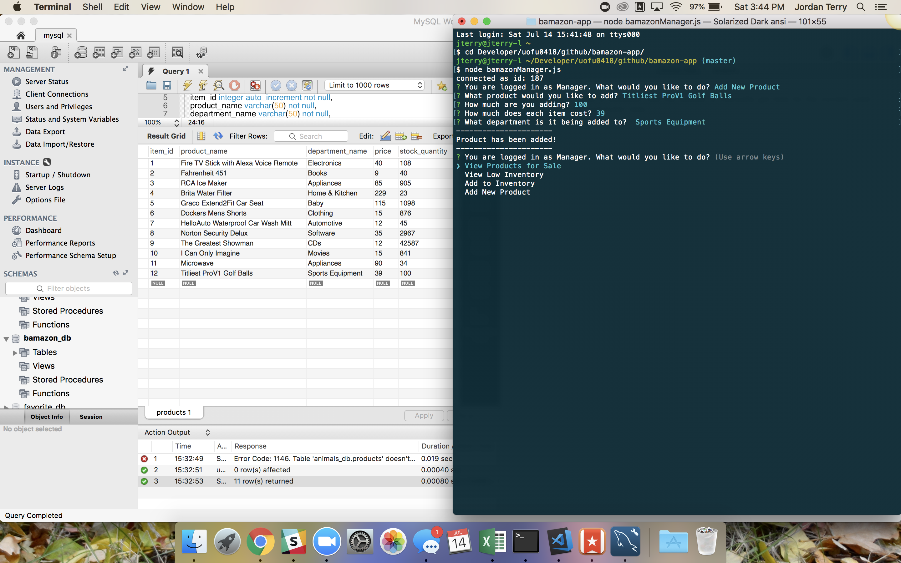

# Bamazon (Node/MySQL)

Bamazon is a node application that is an amazon-like store. The customer can pick an item, quantity, and it will return the total price. The manager can see all items available, view low quantity, add to quantity, and add new items. 

 Below is a preview of Bamazon:

### Customer View

### Manager View

